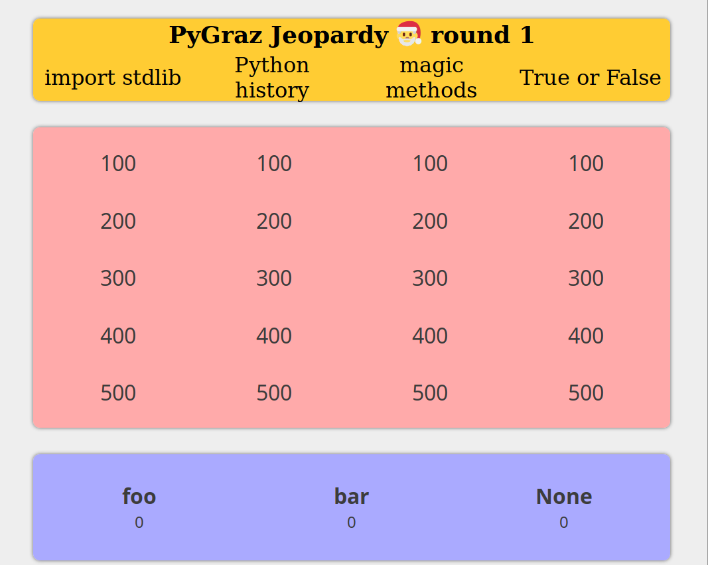

README
======

author::
  meisterluk
version::
  1.0.0
license::
  MIT license

This is a small custom jeopardy implementation as a single HTML file running with Javascript.
It takes all data from `/static/data` and creates its UI using Javascript.
Questions and answers are written in HTML and the reference example is given in `/static/data/qa.txt`.

What is it about?
-----------------

At link:https://pygraz.org/[PyGraz], we did a Jeopardy in December 2018.
meisterluk came up with questions and the audience seemed to enjoy it.
We made 3 teams (by partitioning the room) with about 3 people per team.
A random number generator chose a team and it had to choose a category and difficulty.
"'import stdlib' for 300" is one example.
In the following, the team has to answer the question in feasible time.
Otherwise the question will be open to answers by any responding team.
This way, the first team giving the correct answer got the difficulty level as credit points.
Once all questions are answered, the team with most points won the round and got chocolate.
We played 2 rounds (of 3 rounds, I prepared) this night.

What works properly?
--------------------

* loading questions and answers in HTML format
* users has to specify team names
* Jeopardy theme song included
* round finishes and you start a new round with new teams
* press 'r' to trigger a random-team-generator
* A simple callback to send the state to a webserver

What does not work?
-------------------

* No Double Jeopardy or Final Jeopardy
* Yes/No questions must be credited with "team X gets credits" or "no team gets credits". There is no possibility not to grant credits. As a workaround, I suggest, you create an additional team named "None"; or alike.
* There is no hardware buzzer support
* The Q/A interface does not show the current category + difficulty
* The random-team-generator should not be random. It should uniformly distribute the number of questions posed to teams.
* Add a testsuite for my Javascript code
* Introduce events API

Why should I use it?
--------------------

I have seen Jeopardy software in Java implemented with Spring.
I have seen Jeopardy software compilable with lots of npm packages.
In my implementation, the software stack is minimal.

Who should use it?
------------------

Any organizer of a Jeopardy who can write HTML.

How to run
----------

1. Download this distribution
2. Update the data in `static/data` to your own needs.
3. Open `index.html` in your web browser (and you are ready) OR
   go to the `log` folder, run the go webserver using `go run webserver.go` and visit link:localhost:3141[http://localhost:3141/jeopardy/]

You should see the interface displayed in this figure:

How to use the interface?

1. Enter the names
2. Click on one of the category/difficulty boxes in the grid
3. Click on the Q/A delimiter (the python logos in the vertical center) OR just press space to reveal the answer
4. Click on the team name at the bottom, who answered the question correctly
5. Repeat until all boxes are filled. Then the final winner will be announced.
6. Repeat from (1) for the second round.

Source Code
-----------

The source code is available at link:https://github.com/meisterluk/jeopardy[Github].

License
-------

MIT license.

Issues
------

Please report any issues on the link:https://github.com/meisterluk/jeopardy/issues[Github issues page].
